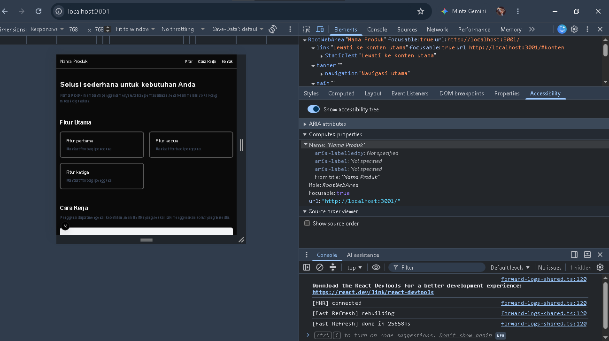
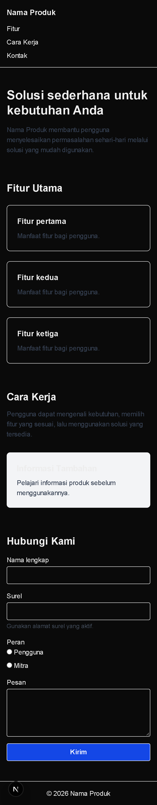
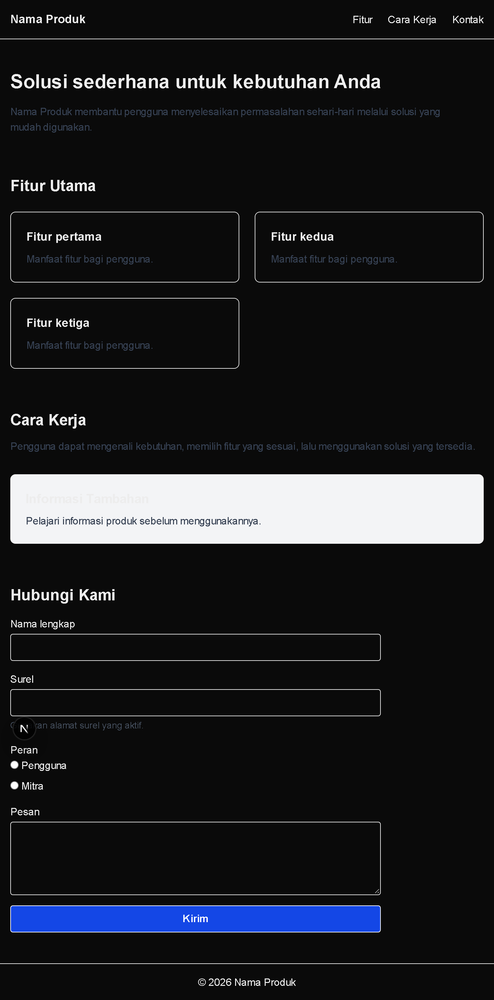
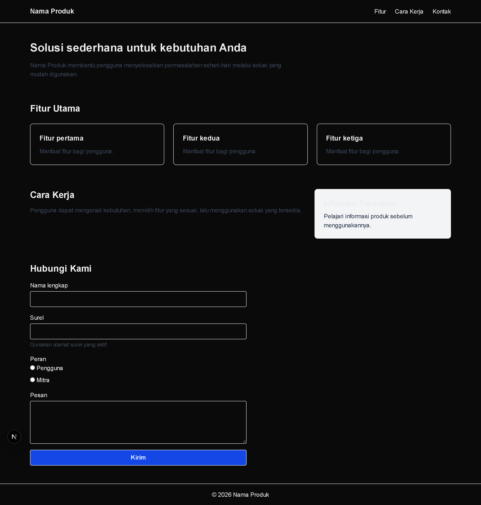
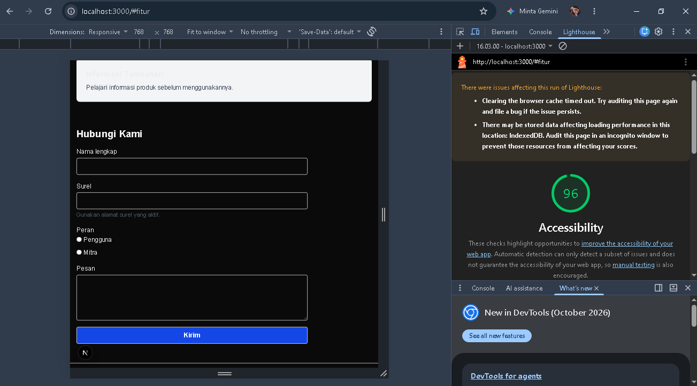
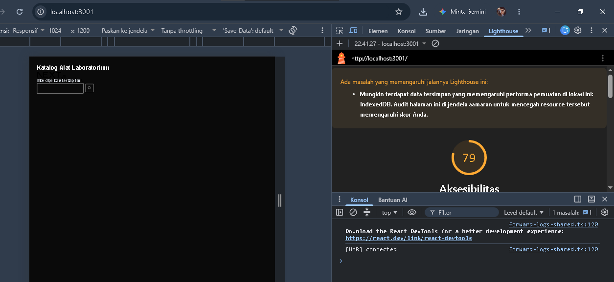

# Dokumen Teknis Modul 2 — HTML Semantik, Tailwind CSS, dan Aksesibilitas

Nama/NIM : Rizqy Hergiansyah / 105224010

Repositori : git@github.com:hergiansyah24/praktikumweb-modul2-produk.git

## 1. Struktur Semantik

Halaman utama produk menggunakan HTML semantik untuk membagi halaman
berdasarkan fungsi dari setiap bagian. Struktur tersebut terdiri dari
`header`, `nav`, `main`, `section`, `aside`, dan `footer`.

Pada bagian atas halaman terdapat `header` yang berisi `nav` sebagai
navigasi utama. Navigasi diberi atribut `aria-label="Navigasi utama"` agar
tujuan navigasi dapat dikenali dengan jelas oleh teknologi bantu.

Di dalam halaman terdapat satu elemen `main` yang menjadi wadah utama
konten. Bagian utama dibagi menjadi beberapa `section`, seperti bagian
pengenalan produk, fitur utama, cara kerja, dan formulir kontak.

Hierarki judul dibuat menggunakan satu `<h1>` sebagai judul utama halaman,
kemudian `<h2>` untuk judul setiap bagian utama dan `<h3>` untuk judul pada
kartu fitur. Penggunaan hierarki tersebut membantu menunjukkan hubungan
antara judul utama, bagian, dan subbagian.

Struktur landmark halaman dapat digambarkan sebagai berikut:

```text
header
└── nav
    ├── Nama Produk
    └── Navigasi utama

main
├── section
│   ├── h1
│   └── deskripsi produk
│
├── section
│   ├── h2 "Fitur Utama"
│   └── kartu fitur
│       └── h3
│
├── section
│   └── h2 "Cara Kerja"
│
├── aside
│   └── Informasi tambahan
│
└── section
    ├── h2 "Hubungi Kami"
    └── formulir kontak

footer

```
### 1.1 Pohon Aksesibilitas

Pemeriksaan accessibility tree dilakukan menggunakan Chrome DevTools pada
halaman utama. Pemeriksaan digunakan untuk melihat bagaimana struktur
halaman dikenali oleh teknologi bantu.

Hasil pemeriksaan menunjukkan adanya `RootWebArea`, skip link, landmark
`banner`, `navigation` dengan nama "Navigasi utama", serta `main` yang
berisi beberapa region halaman.

**Gambar 1. Accessibility Tree halaman utama**



### 1.2 Landmark dan Hierarki Judul

Struktur semantik pada halaman utama menggunakan beberapa landmark HTML
untuk membedakan fungsi setiap bagian halaman. Elemen `<header>` digunakan
sebagai bagian kepala halaman dan di dalamnya terdapat `<nav>` sebagai
navigasi utama. Navigasi diberi `aria-label="Navigasi utama"` agar tujuan
navigasi dapat dikenali dengan jelas.

Elemen `<main>` digunakan sebagai wadah konten utama halaman. Di dalamnya
terdapat beberapa `<section>` untuk mengelompokkan konten berdasarkan
fungsinya. Bagian informasi tambahan menggunakan `<aside>`, sedangkan bagian
akhir halaman menggunakan `<footer>`.

Hierarki judul dibuat dengan satu `<h1>` sebagai judul utama halaman.
Judul bagian utama menggunakan `<h2>`, sedangkan judul pada kartu fitur
menggunakan `<h3>`. Struktur tersebut membuat hubungan antara judul utama,
bagian, dan subbagian menjadi lebih jelas.

Struktur hierarki judul halaman adalah:

```text
<h1> Solusi sederhana untuk kebutuhan Anda
│
├── <h2> Fitur Utama
│   ├── <h3> Fitur pertama
│   ├── <h3> Fitur kedua
│   └── <h3> Fitur ketiga
│
├── <h2> Cara Kerja
│
└── <h2> Hubungi Kami

```
## 2. Tata Letak Responsif

Halaman utama menggunakan pendekatan mobile-first sehingga tampilan disusun terlebih dahulu untuk layar kecil, kemudian menyesuaikan pada ukuran layar yang lebih besar. Pengujian dilakukan pada lebar 360 px, 768 px, dan 1280 px.

### 2.1 Pengujian Responsif 360 px

Pada lebar 360 px, navigasi ditampilkan secara vertikal dan kartu fitur tersusun menjadi satu kolom. Bagian konten dan informasi tambahan juga ditampilkan secara bertumpuk sehingga seluruh isi halaman tetap dapat dibaca tanpa perlu melakukan scroll secara horizontal.

**Gambar 2. Tampilan halaman pada lebar 360 px**



### 2.2 Pengujian Responsif 768 px

Pada lebar 768 px, tata letak mulai memanfaatkan ruang layar yang lebih luas. Kartu fitur dapat tersusun dalam beberapa kolom sehingga penggunaan ruang menjadi lebih efisien. Elemen halaman tetap dapat dibaca dan tidak keluar dari batas viewport.

**Gambar 3. Tampilan halaman pada lebar 768 px**



### 2.3 Pengujian Responsif 1280 px

Pada lebar 1280 px, navigasi ditampilkan secara horizontal. Tiga kartu fitur tersusun dalam satu baris, sedangkan bagian Cara Kerja dan Informasi Tambahan ditampilkan berdampingan. Tampilan ini memanfaatkan ruang layar desktop dengan lebih optimal.

**Gambar 4. Tampilan responsif 1280 px**



### 2.4 Keputusan Teknis

Flexbox digunakan pada bagian navigasi untuk mengatur elemen menu secara horizontal pada layar yang lebih besar dan tetap dapat menyesuaikan pada layar kecil.

Grid digunakan pada bagian fitur karena beberapa kartu perlu disusun secara terstruktur dalam baris dan kolom. Kelas `grid-cols-1`, `sm:grid-cols-2`, dan `lg:grid-cols-3` digunakan agar jumlah kolom menyesuaikan ukuran layar.

Pada bagian Cara Kerja dan Informasi Tambahan digunakan `lg:grid-cols-[2fr_1fr]`. Artinya, pada layar besar kolom konten utama mendapatkan ruang dua kali lebih besar dibandingkan kolom informasi tambahan. Pada layar yang lebih kecil, kedua bagian ditampilkan secara bertumpuk.

Pendekatan tersebut dipilih agar satu struktur halaman dapat digunakan pada berbagai ukuran layar tanpa membuat versi halaman yang berbeda untuk perangkat mobile dan desktop.

## 3. Audit Aksesibilitas

Audit aksesibilitas dilakukan menggunakan Lighthouse pada Chrome DevTools. Audit digunakan untuk memeriksa beberapa aspek aksesibilitas halaman, seperti struktur heading, label pada form, nama elemen interaktif, kontras warna, dan penggunaan elemen HTML yang sesuai.

### 3.1 Hasil Audit Halaman Utama

Hasil pengujian Lighthouse pada halaman utama memperoleh skor **96** untuk kategori Accessibility. Skor tersebut sudah memenuhi target minimal yang ditentukan pada modul, yaitu **85** untuk halaman utama.

**Gambar 5. Hasil Lighthouse halaman utama**



### 3.2 Audit Halaman Latihan

Selain halaman utama, pengujian dilakukan pada halaman latihan audit yang sengaja dibuat dengan beberapa masalah aksesibilitas. Pada pengujian awal, halaman memperoleh skor **79**.

Beberapa masalah yang ditemukan kemudian diperbaiki, antara lain pemberian alternatif teks pada gambar, peningkatan keterbacaan teks, pemberian label pada input, pemberian nama yang dapat dikenali pada tombol, serta penggunaan heading utama yang sesuai.

Setelah perbaikan dilakukan, audit Lighthouse dijalankan kembali dan skor Accessibility meningkat menjadi **100**.

**Gambar 6. Hasil Lighthouse sebelum perbaikan**



**Gambar 7. Hasil Lighthouse setelah perbaikan**


### 3.3 Temuan dan Perbaikan

| Temuan | Perbaikan |
|---|---|
| Gambar tidak memiliki alternatif teks | Menambahkan atribut `alt` pada elemen gambar |
| Teks memiliki kontras yang kurang baik | Menggunakan warna teks yang memiliki kontras lebih jelas terhadap latar |
| Input pencarian tidak memiliki label yang jelas | Menambahkan label yang terhubung dengan input |
| Tombol ikon tidak memiliki nama yang dapat dikenali | Menambahkan `aria-label` pada tombol |
| Struktur heading belum menggunakan heading utama | Menggunakan elemen `<h1>` sebagai judul utama halaman |

Perbaikan tersebut dilakukan agar elemen halaman dapat dikenali dengan lebih baik oleh teknologi bantu dan lebih mudah digunakan oleh pengguna dengan kebutuhan aksesibilitas.

### 3.4 Pengujian Keyboard

Pengujian keyboard dilakukan dengan menggunakan tombol `Tab` dan `Shift + Tab` untuk berpindah antar elemen interaktif pada halaman.

Hasil pengujian menunjukkan bahwa elemen navigasi, input nama, input surel, pilihan peran, textarea pesan, dan tombol `Kirim` dapat dicapai menggunakan keyboard. Indikator fokus juga terlihat ketika elemen mendapatkan fokus.

Urutan fokus berjalan mengikuti urutan elemen pada halaman sehingga pengguna dapat melakukan navigasi tanpa menggunakan mouse.

| Pengujian | Hasil |
|---|---|
| Navigasi menggunakan Tab | Berhasil |
| Navigasi mundur menggunakan Shift + Tab | Berhasil |
| Input form dapat difokuskan | Berhasil |
| Radio button dapat difokuskan | Berhasil |
| Tombol Kirim dapat difokuskan | Berhasil |
| Indikator fokus terlihat | Berhasil |
| Urutan fokus mengikuti struktur halaman | Berhasil |

## 4. Kendala dan Penyelesaian

Selama pengerjaan Modul 2, terdapat beberapa kendala dalam menerapkan struktur HTML semantik, membuat tampilan responsif, dan melakukan audit aksesibilitas.

Kendala pertama adalah memastikan struktur halaman menggunakan elemen semantik seperti `<header>`, `<nav>`, `<main>`, `<section>`, `<aside>`, dan `<footer>` dengan hierarki heading yang sesuai. Kendala tersebut diselesaikan dengan menyesuaikan struktur halaman dan memeriksa Accessibility Tree melalui DevTools.

Kendala berikutnya ditemukan saat melakukan audit Lighthouse. Halaman latihan awalnya memperoleh skor aksesibilitas 79 karena terdapat beberapa masalah seperti gambar tanpa atribut `alt`, input tanpa label yang jelas, tombol ikon tanpa nama yang dapat diakses, kontras teks yang kurang, dan belum adanya heading utama. Masalah tersebut diperbaiki dengan menambahkan atribut dan elemen aksesibilitas yang sesuai. Setelah diperbaiki, skor Lighthouse meningkat menjadi 100.

Selain itu, dilakukan pengujian tampilan pada beberapa ukuran layar, yaitu 360 px, 768 px, dan 1280 px. Penggunaan breakpoint Tailwind CSS dan layout Grid/Flexbox disesuaikan agar halaman tetap dapat digunakan tanpa terjadi horizontal scroll.

## 5. Catatan Pemanfaatan AI

Dalam pengerjaan Modul 2, AI yang digunakan adalah **ChatGPT, Gemini dan deepseek** sebagai alat bantu dalam memahami materi, menyusun struktur kode, dan membantu mencari solusi ketika terdapat kendala pada implementasi.

Perintah utama yang digunakan berupa pertanyaan mengenai HTML semantik, Tailwind CSS, responsive layout, aksesibilitas, Lighthouse, serta perbaikan kode pada halaman latihan audit.

Bagian yang dibantu oleh AI meliputi penyusunan struktur `page.tsx`, penerapan Flexbox dan Grid, penggunaan breakpoint responsive, penerapan label dan atribut aksesibilitas pada form, serta analisis masalah yang ditemukan melalui Lighthouse.

Setiap hasil dari AI tetap diverifikasi secara manual dengan menjalankan aplikasi menggunakan `npm run dev`, melihat tampilan pada beberapa ukuran layar, memeriksa Accessibility Tree pada DevTools, serta menjalankan audit Lighthouse. Kode juga diperiksa kembali agar sesuai dengan ketentuan Modul 2.